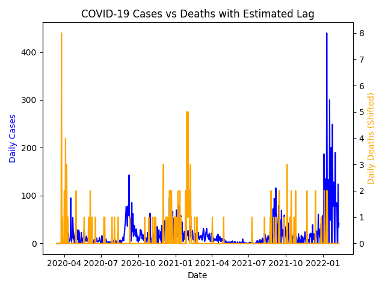
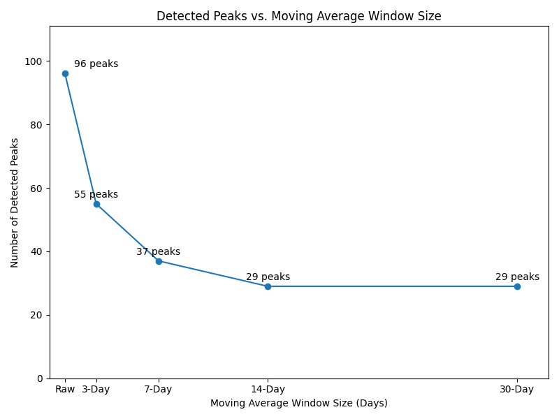
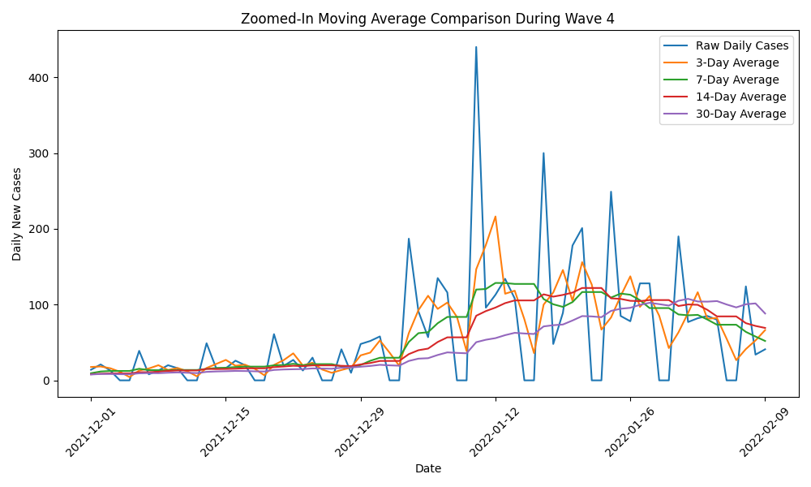
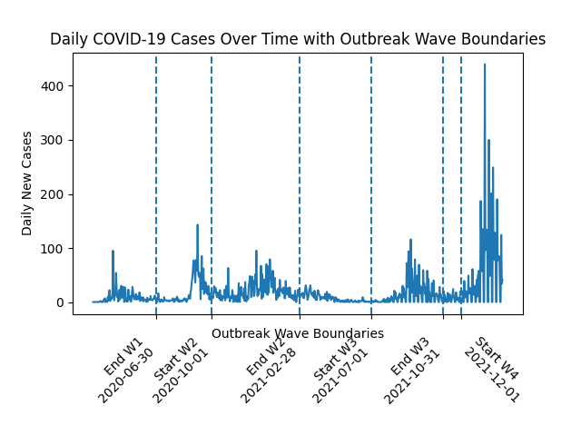
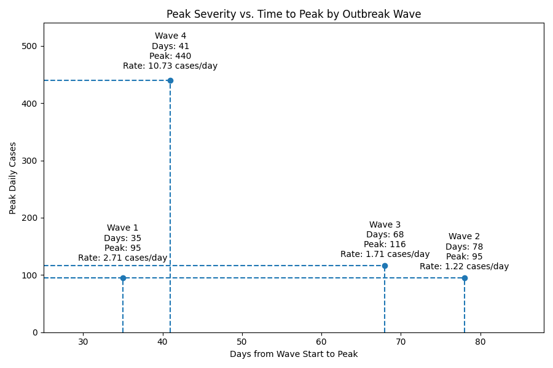

# COVID-19 Data Analysis Project  
ENGR 315 Final Project  

**Team Members:**  
- Caleb Miller  
- Kimberly Carter  
- Jake Kozura  

---

## Project Overview

This project analyzes COVID-19 case and death data to identify trends, relationships, and patterns over time. The dataset was obtained from Data.gov and contains time-series data including daily case counts, death counts, and dates.

The goal of this project is to apply data analysis techniques learned throughout the course, including filtering, averaging, correlation analysis, and visualization.

---

## Dataset

- Source: https://catalog.data.gov/dataset/covid-19-case-surveillance-public-use-data  
- Data Type: Time-series (daily values)  
- Key Variables:
  - Date
  - Daily COVID-19 cases
  - Daily COVID-19 deaths
  - Location (county/state)

---

## Research Questions

### Question 1  
**Is there a temporal lag between COVID-19 cases and deaths?**

### Question 2  
**How does moving average window size affect trend interpretation?**

### Question 3  
**How does growth rate differ between outbreak waves?**

---

## Methods & Analysis

### Question 1 (Temporal Lag)
- Converted cumulative data → daily values
- Tested lag values from 0–30 days
- Shifted death data relative to case data
- Calculated correlation at each lag
- Selected lag with highest correlation

### Question 2 (Moving Average)
- Applied moving averages (3, 7, 14, 30 days)
- Compared smoothed vs raw data
- Calculated:
  - Standard deviation (data variability)
  - Peak counts (local maxima)
- Zoomed into Wave 4 for detailed comparison

### Question 3 (Growth Rate by Wave)
- Divided dataset into 4 outbreak waves
- For each wave:
  - Identified peak daily cases
  - Calculated days to peak
  - Computed growth rate (cases/day)
- Compared severity and speed of outbreaks

---

## Results

### Question 1
- Best lag: **28 days**
- Correlation: **0.154 (weak)**
- Interpretation: Weak alignment due to variability in death data

### Question 2
- Standard deviation decreases as window size increases
- Peak counts decrease:
  - Raw: 96 peaks  
  - 3-day: 55 peaks  
  - 7-day: 37 peaks  
  - 14-day: 29 peaks  
  - 30-day: 29 peaks  
- Interpretation: Larger windows smooth noise and highlight major trends

### Question 3
- Wave 4 had:
  - Highest peak (~440 cases/day)
  - Fastest growth (~10.7 cases/day)
- Interpretation: Later waves showed more aggressive spread

---

## Visualizations

### Question 1 Plots

### Question 2 Plots

### Question 3 Plots

---

## Key Insights

- COVID-19 deaths lag cases by ~4 weeks, but correlation is weak at county level  
- Moving averages significantly reduce noise and improve trend clarity  
- Later outbreak waves (especially Wave 4) were more severe and grew faster  

---

## Tools Used

- Python
- NumPy
- Pandas
- Matplotlib